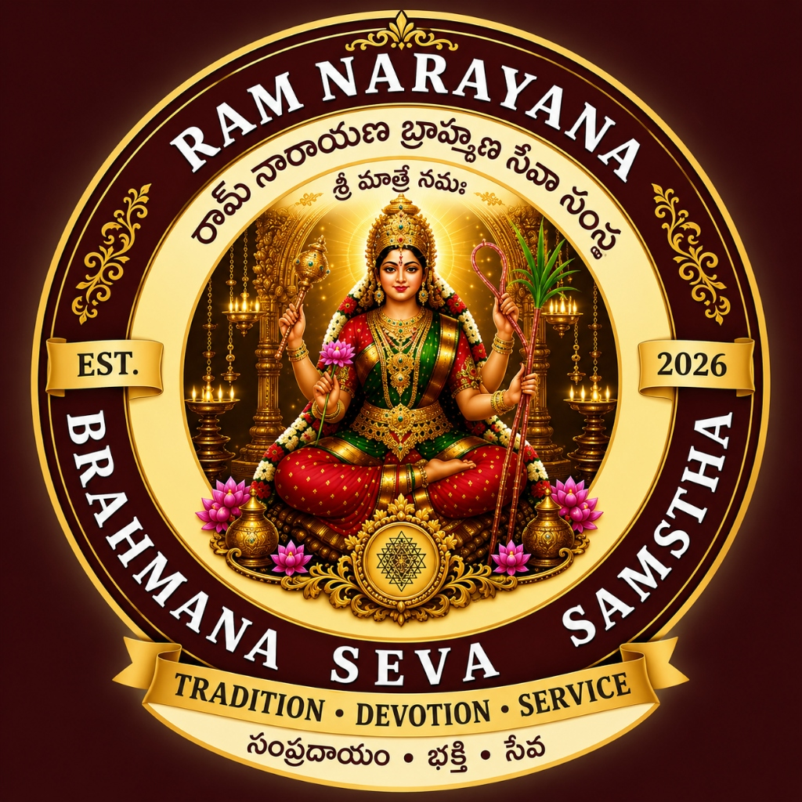



  <!-- Logo & Title Header -->
  

  # 🕉️ రామ్ నారాయణ బ్రాహ్మణ సేవా సంస్థ
  ### **Ram Narayana Brahmana Seva Samstha**
  *Authentic Vedic Rites • Ancestral Pitru Karyas • Satvik Traditions • Sacred Heritage*

  

    <strong>Dedicated to preserving Sanatana Dharma under the divine guidance of Pro. Namburi Adinarayana Murthy.</strong> 
    <em>Dilsukhnagar, Hyderabad, Telangana, India</em>
  

  <!-- Live Deployment & Technology Badges -->
  

    
    
    
    
  

  <!-- Tech Stack Pills -->
  

    
    
    
    
    
    
  

  <h4>
    🌐 <a href="https://ram-narayana-brahmana-seva-samstha.vercel.app/"><strong>Explore Live Production Website »</strong></a>
  </h4>

---

## 📌 Table of Contents
- [🌟 Overview & Mission](#-overview--mission)
- [✨ Key Features & Engineering Highlights](#-key-features--engineering-highlights)
- [🕉️ Core Vedic Services](#️-core-vedic-services)
- [🎨 Design System & Visual Identity](#-design-system--visual-identity)
- [🛠️ Tech Stack & Architecture](#️-tech-stack--architecture)
- [📂 Codebase Structure](#-codebase-structure)
- [🚀 Quick Start & Local Setup](#-quick-start--local-setup)
- [📱 Responsive Breakpoints & Cross-Device Support](#-responsive-breakpoints--cross-device-support)
- [👩‍💻 Author & Developer Profile](#-author--developer-profile)
- [📜 License & Credits](#-license--credits)

---

## 🌟 Overview & Mission

**Ram Narayana Brahmana Seva Samstha** (రామ్ నారాయణ బ్రాహ్మణ సేవా సంస్థ) is an authentic, sacred digital portal for Vedic rites and ancestral ceremonies situated in Dilsukhnagar, Hyderabad.

Under the venerated guidance of **Pro. Namburi Adinarayana Murthy**, this platform connects devotees with experienced Vedic scholars (*Purohits*), disciplined Vedic guests (*Bhokthas*), authentic Agnihotra Parayanam, traditional ritual catering (*Satvik Bhojanam*), and complete ceremonial arrangements in full adherence to *Shastras* and *Sanatana Dharma*.

### 🎯 Key Objectives:
- **Preservation of Sacred Heritage:** Modernizing accessibility to ancient Vedic rituals without compromising ritualistic sanctity.
- **Flawless User Experience:** Delivering high-speed, zero-dependency, ultra-lightweight client performance with an authentic Temple Maroon & Pure Gold aesthetic.
- **Bilingual Inclusivity:** Full native support for both Telugu (తెలుగు) and English with instant dynamic switching.

---

## ✨ Key Features & Engineering Highlights

`
┌─────────────────────────────────────────────────────────────────────────────────────────┐
│                                ARCHITECTURE & CAPABILITIES                              │
├──────────────────────────┬───────────────────────────┬──────────────────────────────────┤
│ 🌐 Real-Time Bilingual   │ 📱 100% Fluid Responsive  │ ⚡ Zero-Framework Performance     │
│ Instant i18n switching   │ Mobile, Tablet, Laptop,   │ Pure HTML5, Vanilla CSS3, & ES6+ │
│ without page reload      │ Desktop & Foldables       │ No heavy libraries / Instant TTL │
├──────────────────────────┼───────────────────────────┼──────────────────────────────────┤
│ 🕉️ 4 Core Vedic Cards    │ 📍 Interactive Geo & CTAs │ 🔍 Semantic SEO & Schema.org     │
│ Categorized Shastric     │ Direct WhatsApp, One-Tap  │ Full JSON-LD structured metadata │
│ ancestral services       │ Calling, & Google Maps    │ for enhanced search rich cards   │
└──────────────────────────┴───────────────────────────┴──────────────────────────────────┘
`

- **🎨 Vedic Light Theme Design System:** Handcrafted color palette featuring Deep Sacred Maroon (#851317), Pure Temple Gold (#D4AF37), and Warm Ivory Parchment (#FFFDF8).
- **⚡ Dynamic Desktop & Mobile Navigation:**
  - Desktop: Hover & Click Dropdown navigation with custom micro-animations.
  - Mobile: Smooth sliding collapsible navigation drawer with accordion submenus.
- **📸 High-Res Media Showcase & Lightbox:** Zoomable interactive modal gallery featuring official banners, pamphlets, and credentials.
- **♿ Accessibility & Semantic Standards:** Accessible ARIA attributes, semantic HTML5 structure, keyboard navigation, and WCAG-compliant color contrast.
- **📱 Zero-CLS Fluid Layouts:** CSS clamp() typography and container queries prevent text clipping and horizontal scrolling across all viewport widths (from iPhone SE up to 4K Ultrawide).

---

## 🕉️ Core Vedic Services

The Samstha provides 4 focused, Shastra-compliant ritual services:

| # | Service Category (తెలుగు) | Service Name (English) | Sacred Scope & Arrangements |
|---|---|---|---|
| **01** | **వైదిక బ్రాహ్మణుల సేవా** | Vaidika Brahmana Seva | Veda Parayanam, Rudra Namaka-Chamaka Parayanam, Gayatri & Mrityunjaya Japas, Ganapathi & Chandi Homas. |
| **02** | **భోక్తల సేవా** | Bhoktha Seva | Disciplined, orthodox Brahmin Bhokthas for Shraddha meals adhering strictly to Shastric codes. |
| **03** | **పితృకార్యాలు & శ్రాద్ధకర్మలు** | Pitru Karyas & Shraddha Karmas | Masikam, Abdikam, Samvatsarikam, Mahalaya Paksha Tarpana, and Pinda Pradanam. |
| **04** | **సాత్విక వంట & సంపూర్ణ నిర్వహణ** | Satvik Catering & Full Arrangements | Traditional Satvik Brahmin culinary preparation, puja samagri, and clean sacred venue arrangements. |

---

## 🎨 Design System & Visual Identity

### 🎨 Color Palette
`css
:root {
  --color-primary:          #851317;  /* Deep Temple Maroon */
  --color-primary-dark:     #5C0A0E;  /* Royal Crimson Shade */
  --color-secondary:        #D4AF37;  /* Pure Shastric Gold */
  --color-secondary-light:  #FFE082;  /* Divine Gold Glow */
  --bg-main:                #FAF7F0;  /* Warm Sacred Ivory */
  --bg-card:                #FFFFFF;  /* Crisp Card Background */
  --text-main:              #241508;  /* Deep Charcoal Brown */
  --text-muted:             #5C4A3A;  /* Soft Ochre Text */
}
`

### 🔤 Typography
- **Telugu Headings & Body:** 'Tiro Telugu', 'Mandali', 'Gautami', sans-serif
- **English Headings:** 'Cinzel', 'Playfair Display', Georgia, serif
- **Body & UI Controls:** 'Inter', 'Plus Jakarta Sans', system-ui, sans-serif

---

## 🛠️ Tech Stack & Architecture

- **Frontend Core:** Pure HTML5 (Semantic5)
- **Styling Architecture:** Modern Vanilla CSS3 (Custom Properties, Flexbox, Grid, Glassmorphism, CSS clamp())
- **Client Scripting:** Modular Vanilla JavaScript (ES6+)
- **Structured Data:** Schema.org LocalBusiness JSON-LD
- **Cloud Hosting & CDN:** [Vercel](https://vercel.com/) Edge Network
- **Icons & Assets:** Optimized SVG & High-Resolution Compressed WebP/JPEG

---

## 📂 Codebase Structure

`ash
RamNarayanaBrahmanaSevaSamstha/
├── 📁 assets/
│   ├── 📁 css/
│   │   └── style.css            # Master stylesheet & responsive design system
│   ├── 📁 images/
│   │   ├── banner-new.jpg       # Official grand banner
│   │   ├── card-cream.jpg       # Authentic visiting card
│   │   ├── flyer-en.jpg         # English brochure flyer
│   │   ├── flyer-te.jpg         # Telugu brochure flyer
│   │   ├── logo.jpg             # High-res official circular emblem
│   │   ├── pamphlet.jpg         # High-res reference pamphlet
│   │   └── pamphlet.png         # Transparent emblem asset
│   └── 📁 js/
│       ├── app.js               # UI controls, lightbox, drawer, scrollspy
│       └── translations.js      # Complete Telugu & English i18n dictionaries
├── index.html                   # Core semantic web application
├── README.md                    # Engineering documentation & developer profile
└── .gitignore                   # Version control ignore configuration
`

---

## 🚀 Quick Start & Local Setup

### 1️⃣ Clone the Repository
`ash
git clone https://github.com/chintadavasudharini/RamNarayanaBrahmanaSevaSamstha.git
cd RamNarayanaBrahmanaSevaSamstha
`

### 2️⃣ Run Locally
Since this project uses zero external build dependencies, you can run it with any static web server:

**Using Python 3:**
`ash
python -m http.server 8000
`

**Using Node.js (
px serve):**
`ash
npx serve .
`

**Using VS Code Live Server:**
Right-click index.html → select **"Open with Live Server"**.

### 3️⃣ View in Browser
Navigate to http://localhost:8000 in your web browser.

---

## 📱 Responsive Breakpoints & Cross-Device Support

| Device Category | Target Viewport Width | Navigation Mode | Layout Grid |
|---|---|---|---|
| **Mobile Phones (Small/Medium)** | 320px - 480px | Bottom Sticky Action Bar + Drawer | 1 Column Full Width |
| **Smartphones (Large) & Phablets** | 481px - 767px | Bottom Sticky Action Bar + Drawer | 1 - 2 Columns Fluid |
| **Tablets & iPads (Portrait/Landscape)** | 768px - 1024px| Top Header + Drawer Trigger | 2 Columns Grid |
| **Laptops & MacBooks** | 1025px - 1440px | Desktop Header + Dropdowns | 2x2 Symmetrical Grid |
| **Desktop Monitors & 4K Displays** | > 1440px | Desktop Header + Dropdowns | Constrained Container (1480px) |

---

## 👩‍💻 Author & Developer Profile

<table align="center" style="border-collapse: collapse; border: none;">
  <tr>
    <td align="center" style="border: none; padding: 20px;">
      
        
      <h3><strong>Chintada Vasudharini</strong></h3>
      
<strong>Python Full Stack Developer | AWS Cloud | AI & Data Science</strong>

      
📍 <em>KL University | B.Tech Computer Science and Engineering</em>

    </td>
  </tr>
</table>

### 🌐 Connect with the Developer:
- 💼 **LinkedIn:** [Chintada Vasudharini](https://www.linkedin.com/in/chintada-vasudharini-nov21/)
- 🐙 **GitHub:** [@chintadavasudharini](https://github.com/chintadavasudharini)
- 🚀 **Personal Portfolio:** [chintadavasudharini-portfolio.vercel.app](https://chintadavasudharini-portfolio.vercel.app/)
- 📧 **Email:** [chintadavasudharini@gmail.com](mailto:chintadavasudharini@gmail.com)

`python
class Developer:
    def __init__(self):
        self.name = "Chintada Vasudharini"
        self.role = "Python Full Stack Developer & AI Enthusiast"
        self.education = "B.Tech CSE - KL University"
        self.skills = ["Python", "JavaScript", "HTML5/CSS3", "AWS", "AI/DS", "REST APIs", "Full Stack Web"]
        self.passions = ["Sacred Heritage Preservation", "High-Performance Web Architecture", "Cloud Solutions"]

    def say_hi(self):
        return "Thank you for visiting! Let's build impactful technologies together."
`

---

## 📜 License & Credits

- **Software Engineering & Architecture:** Developed with ❤️ by [**Chintada Vasudharini**](https://github.com/chintadavasudharini).
- **Vedic Direction & Supervision:** **Pro. Namburi Adinarayana Murthy** (రామ్ నారాయణ బ్రాహ్మణ సేవా సంస్థ).
- **License:** Open-sourced under the [MIT License](LICENSE).

  © 2026 Ram Narayana Brahmana Seva Samstha. All rights reserved. • Built with devotion and precision.

